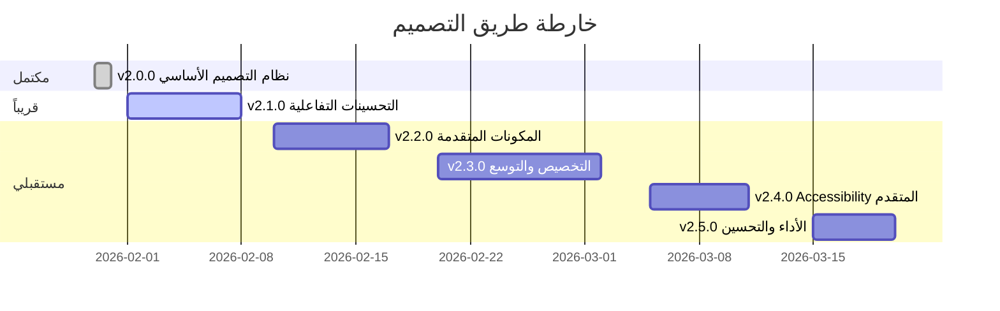

# خارطة طريق التصميم - منصة فكرة

## 🗺️ الإصدارات المستقبلية

---

## ✅ v2.0.0 - مكتمل (30 يناير 2026)

### التحديثات الرئيسية
- ✅ نظام تصميم موحد (Blueprint + Neo Brutalism)
- ✅ خط Cairo العربي
- ✅ دعم RTL كامل
- ✅ إزالة جميع الإيموجي
- ✅ أيقونات Lucide
- ✅ وثائق شاملة

**الحالة**: ✅ مكتمل ومستقر

---

## 🚀 v2.1.0 - التحسينات التفاعلية (مخطط)

### الأولوية: عالية
**الهدف**: تحسين التفاعلية وتجربة المستخدم

#### الميزات المخططة

##### 1. أنيميشن للانتقالات
```tsx
// مثال
import { motion } from 'framer-motion'

<motion.div
  initial={{ opacity: 0, y: 20 }}
  animate={{ opacity: 1, y: 0 }}
  transition={{ duration: 0.3 }}
>
  <Card>محتوى</Card>
</motion.div>
```

**الفوائد**:
- تجربة أكثر سلاسة
- انتقالات احترافية
- تفاعل أفضل

**المدة المتوقعة**: 3-5 أيام

##### 2. Skeleton Loaders
```tsx
// مثال
<SkeletonCard />
<SkeletonTable />
<SkeletonList />
```

**الفوائد**:
- تجربة تحميل أفضل
- تقليل الشعور بالانتظار
- مظهر احترافي

**المدة المتوقعة**: 2-3 أيام

##### 3. Tooltips محسّنة
```tsx
// مثال
<Tooltip content="معلومة مفيدة">
  <Info className="w-4 h-4" />
</Tooltip>
```

**الفوائد**:
- مساعدة أفضل للمستخدم
- توضيح الحقول المعقدة
- تحسين UX

**المدة المتوقعة**: 2-3 أيام

---

## 🎨 v2.2.0 - المكونات المتقدمة (مخطط)

### الأولوية: متوسطة
**الهدف**: إضافة مكونات UI متقدمة

#### الميزات المخططة

##### 1. Modal (نافذة منبثقة)
```tsx
<Modal isOpen={isOpen} onClose={onClose}>
  <h2>عنوان</h2>
  <p>محتوى</p>
  <Button>إغلاق</Button>
</Modal>
```

##### 2. Dropdown (قائمة منسدلة)
```tsx
<Dropdown>
  <DropdownTrigger>
    <Button>خيارات</Button>
  </DropdownTrigger>
  <DropdownContent>
    <DropdownItem>خيار 1</DropdownItem>
    <DropdownItem>خيار 2</DropdownItem>
  </DropdownContent>
</Dropdown>
```

##### 3. Toast محسّن
```tsx
toast.success('نجح!', {
  icon: <CheckCircle />,
  style: { /* نمط موحد */ }
})
```

##### 4. Tabs (تبويبات)
```tsx
<Tabs defaultValue="tab1">
  <TabsList>
    <TabsTrigger value="tab1">تبويب 1</TabsTrigger>
    <TabsTrigger value="tab2">تبويب 2</TabsTrigger>
  </TabsList>
  <TabsContent value="tab1">محتوى 1</TabsContent>
  <TabsContent value="tab2">محتوى 2</TabsContent>
</Tabs>
```

**المدة المتوقعة**: 5-7 أيام

---

## 🌐 v2.3.0 - التخصيص والتوسع (مخطط)

### الأولوية: منخفضة
**الهدف**: قابلية التخصيص والتوسع

#### الميزات المخططة

##### 1. نظام Themes قابل للتخصيص
```tsx
// السماح للمستخدمين بتخصيص الألوان
const customTheme = {
  primary: '#custom-color',
  // ...
}

<ThemeProvider theme={customTheme}>
  <App />
</ThemeProvider>
```

##### 2. دعم لغات إضافية
```tsx
// إضافة الإنجليزية
<html lang="en" dir="ltr">

// نظام i18n
import { useTranslation } from 'next-i18next'
```

##### 3. مكونات قابلة للتخصيص
```tsx
// السماح بتخصيص المكونات
<Button customStyles={{ /* ... */ }}>
```

**المدة المتوقعة**: 7-10 أيام

---

## ♿ v2.4.0 - Accessibility المتقدم (مخطط)

### الأولوية: متوسطة
**الهدف**: تحسين إمكانية الوصول

#### الميزات المخططة

##### 1. ARIA Labels محسّنة
```tsx
<Button aria-label="إنشاء طلب جديد">
  <Plus />
</Button>
```

##### 2. Keyboard Navigation محسّن
```tsx
// دعم Tab, Enter, Escape, Arrow keys
```

##### 3. Screen Reader Support
```tsx
<div role="alert" aria-live="polite">
  رسالة للقارئ الشاشة
</div>
```

##### 4. Focus Management
```tsx
// إدارة التركيز بشكل أفضل
useFocusTrap()
```

**المدة المتوقعة**: 4-6 أيام

---

## 🚀 v2.5.0 - الأداء والتحسين (مخطط)

### الأولوية: متوسطة
**الهدف**: تحسين الأداء

#### الميزات المخططة

##### 1. Lazy Loading للأيقونات
```tsx
// تحميل الأيقونات عند الحاجة فقط
const Icon = lazy(() => import('lucide-react').then(m => ({ default: m.CheckCircle })))
```

##### 2. Image Optimization
```tsx
// تحسين الصور
<Image
  src="/image.jpg"
  width={800}
  height={600}
  loading="lazy"
  placeholder="blur"
/>
```

##### 3. CSS Optimization
```css
/* تقليل حجم CSS */
/* إزالة الكلاسات غير المستخدمة */
```

##### 4. Bundle Size Reduction
```
// تقليل حجم الحزمة
// tree shaking
// code splitting
```

**المدة المتوقعة**: 3-5 أيام

---

## 📊 الجدول الزمني المتوقع



---

## 🎯 الأولويات

### الآن (الشهر القادم)
1. 🔥 v2.1.0 - التحسينات التفاعلية
   - أنيميشن
   - Skeleton loaders
   - Tooltips

### قريباً (2-3 أشهر)
2. 🔥 v2.2.0 - المكونات المتقدمة
   - Modal
   - Dropdown
   - Tabs

3. 🔥 v2.4.0 - Accessibility
   - ARIA labels
   - Keyboard navigation

### لاحقاً (3-6 أشهر)
4. 💡 v2.3.0 - التخصيص
   - نظام Themes
   - دعم لغات إضافية

5. 💡 v2.5.0 - الأداء
   - Lazy loading
   - Optimization

---

## 📝 ملاحظات

### المبادئ الأساسية
- ✅ **لا تكسر التصميم الحالي** - التحديثات يجب أن تكون إضافية
- ✅ **اتبع نظام التصميم** - التناسق مهم
- ✅ **اختبر RTL دائماً** - لا تنسَ العربية
- ✅ **وثّق كل شيء** - للفريق المستقبلي

### معايير القبول
- ✅ يعمل في الوضعين (ليلي/نهاري)
- ✅ يدعم RTL بشكل كامل
- ✅ يتبع نظام الألوان
- ✅ موثق بشكل جيد
- ✅ مختبر بشكل شامل

---

## 🤝 المساهمة

### كيف تساهم؟

1. **اختر ميزة** من الخارطة
2. **راجع الوثائق** الحالية
3. **صمم الحل** حسب النظام
4. **طوّر الميزة** مع الاختبار
5. **وثّق التغييرات** بشكل شامل
6. **اطلب المراجعة** من الفريق

---

## 📊 التقدم

### v2.0.0
```
████████████████████ 100%
```

### v2.1.0
```
░░░░░░░░░░░░░░░░░░░░ 0%
```

### v2.2.0
```
░░░░░░░░░░░░░░░░░░░░ 0%
```

---

## 🎉 الرؤية المستقبلية

### السنة الأولى (2026)
- ✅ نظام تصميم موحد
- 🔄 مكونات متقدمة
- 🔄 تحسينات الأداء
- 🔄 Accessibility كامل

### السنة الثانية (2027)
- 🔮 نظام Themes متقدم
- 🔮 دعم لغات متعددة
- 🔮 مكتبة مكونات كاملة
- 🔮 Design System Package

### الرؤية طويلة المدى
- 🔮 أفضل نظام تصميم معماري في المنطقة
- 🔮 مرجع للمنصات الهندسية
- 🔮 مكتبة مفتوحة المصدر

---

## 💪 التحديات المتوقعة

### تقنية
1. ⚠️ الحفاظ على الأداء مع إضافة ميزات
2. ⚠️ التوافق مع المتصفحات القديمة
3. ⚠️ حجم Bundle مع المكونات الجديدة

### تصميمية
1. ⚠️ الحفاظ على التناسق
2. ⚠️ التوازن بين الميزات والبساطة
3. ⚠️ دعم حالات استخدام جديدة

### الحلول المقترحة
- ✅ Code splitting
- ✅ Lazy loading
- ✅ مراجعة دورية للتصميم
- ✅ اختبار مستمر

---

## 📈 مقاييس النجاح

### للإصدار v2.1.0
- [ ] Lighthouse Score: 95+
- [ ] Bundle Size: < 200KB
- [ ] Load Time: < 2s
- [ ] User Satisfaction: 90%+

### للإصدار v2.2.0
- [ ] Component Library: 20+ components
- [ ] Documentation: 100% coverage
- [ ] Test Coverage: 80%+

---

## 🎯 الأهداف الاستراتيجية

### قصيرة المدى (3 أشهر)
1. ✅ إكمال v2.1.0
2. ✅ إكمال v2.2.0
3. ✅ جمع feedback من المستخدمين

### متوسطة المدى (6 أشهر)
1. ✅ إكمال v2.4.0
2. ✅ تحسين الأداء
3. ✅ توسيع المكتبة

### طويلة المدى (سنة)
1. ✅ نظام تصميم كامل
2. ✅ مكتبة مكونات شاملة
3. ✅ مرجع للمنصات الأخرى

---

## 💡 أفكار للمستقبل

### تجريبية
1. 🔮 Dark Mode تلقائي حسب الوقت
2. 🔮 نظام Themes متعدد (ليس فقط ليلي/نهاري)
3. 🔮 تخصيص الألوان للمستخدمين
4. 🔮 وضع عالي التباين للضعف البصري
5. 🔮 أنيميشن متقدمة (Parallax, 3D)

### مبتكرة
1. 🔮 AI-powered design suggestions
2. 🔮 تصميم تكيفي حسب الجهاز
3. 🔮 وضع توفير البطارية
4. 🔮 تخصيص حسب تفضيلات المستخدم

---

## 📊 KPIs (مؤشرات الأداء)

### التصميم
- **التناسق**: 100% عبر الصفحات
- **دعم RTL**: 100% على جميع المكونات
- **Dark Mode**: 100% على جميع الصفحات
- **Responsive**: 100% على جميع الأحجام

### الأداء
- **Lighthouse Score**: 95+
- **Load Time**: < 2s
- **Bundle Size**: < 200KB
- **FCP**: < 1s

### تجربة المستخدم
- **User Satisfaction**: 90%+
- **Task Completion**: 95%+
- **Error Rate**: < 5%
- **Return Rate**: 80%+

---

## 🔄 عملية التحديث

### لكل إصدار جديد

1. **التخطيط**
   - تحديد الميزات
   - تقدير المدة
   - تحديد الأولويات

2. **التصميم**
   - رسم wireframes
   - تصميم mockups
   - مراجعة الفريق

3. **التطوير**
   - كتابة الكود
   - اتباع نظام التصميم
   - الاختبار المستمر

4. **المراجعة**
   - Code review
   - Design review
   - Testing

5. **التوثيق**
   - تحديث الأدلة
   - كتابة أمثلة
   - تحديث CHANGELOG

6. **النشر**
   - Deploy to production
   - مراقبة الأداء
   - جمع feedback

---

## 📅 الجدول الزمني

### Q1 2026 (يناير - مارس)
- ✅ v2.0.0 - نظام التصميم الأساسي
- 🔄 v2.1.0 - التحسينات التفاعلية
- 🔄 v2.2.0 - المكونات المتقدمة

### Q2 2026 (أبريل - يونيو)
- 📅 v2.3.0 - التخصيص والتوسع
- 📅 v2.4.0 - Accessibility المتقدم
- 📅 v2.5.0 - الأداء والتحسين

### Q3 2026 (يوليو - سبتمبر)
- 📅 v3.0.0 - إصدار رئيسي جديد
- 📅 ميزات متقدمة
- 📅 تحسينات شاملة

---

## 🎓 التعلم المستمر

### ما نتابعه
1. 📚 أحدث اتجاهات التصميم
2. 📚 best practices في UI/UX
3. 📚 تحديثات Tailwind CSS
4. 📚 تحديثات Next.js
5. 📚 feedback المستخدمين

### كيف نتحسن
1. 🔄 مراجعة دورية للتصميم
2. 🔄 اختبار A/B
3. 🔄 جمع metrics
4. 🔄 تحليل البيانات
5. 🔄 التحسين المستمر

---

## 🏆 الهدف النهائي

### الرؤية
> **"أن تكون منصة فكرة المرجع في التصميم المعماري الرقمي"**

### القيم
- ✅ **الاحترافية** - تصميم عالمي المستوى
- ✅ **العربية أولاً** - دعم كامل للغة العربية
- ✅ **سهولة الاستخدام** - تجربة ممتازة
- ✅ **الابتكار** - دائماً نتطور

---

## 📞 المشاركة

### شارك برأيك!
- 💬 اقترح ميزات جديدة
- 💬 أبلغ عن مشاكل
- 💬 شارك أفكارك
- 💬 ساهم في التطوير

---

## ✅ الخلاصة

خارطة الطريق واضحة ومحددة. نحن ملتزمون بتطوير مستمر لتقديم أفضل تجربة للمستخدمين.

**المستقبل مشرق! 🌟**

---

*آخر تحديث: 30 يناير 2026*
*الإصدار الحالي: v2.0.0*
*الإصدار القادم: v2.1.0*
