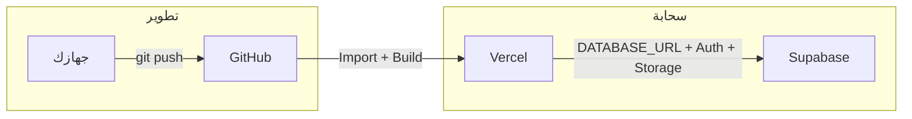

# رفع المشروع عبر GitHub و Supabase

دليل خطوة بخطوة لرفع **منصة فكرة** على GitHub وربطها بـ Supabase (قاعدة بيانات، مصادقة، تخزين) ثم النشر.

---

## نظرة عامة

| المنصة | الدور |
|--------|--------|
| **GitHub** | تخزين الكود ومصدر البناء للنشر. |
| **Supabase** | قاعدة بيانات (PostgreSQL)، مصادقة (Auth)، تخزين ملفات (Storage bucket `orders`). |
| **Vercel** | يستورد المشروع من GitHub ويبني وينشر التطبيق؛ يتصل بـ Supabase عبر متغيرات البيئة. |



---

## الجزء 1: رفع الكود إلى GitHub

### 1.1 إنشاء مستودع على GitHub

1. ادخل إلى [github.com](https://github.com) وسجّل الدخول.
2. اضغط **+** (أعلى اليمين) ثم **New repository**.
3. **Repository name:** مثلاً `fekra-platform` أو `think-1-0` (أحرف صغيرة، أرقام وشرطات فقط).
4. اختر **Private** أو **Public** حسب رغبتك.
5. **لا** تختر "Add a README" إن كان المشروع موجوداً محلياً بالفعل.
6. اضغط **Create repository**.

### 1.2 ربط المشروع المحلي ودفع الكود

من مجلد المشروع على جهازك (في الطرفية):

```bash
# إن لم يكن المجلد مبدوءاً كـ git
git init

# ربط المستودع البعيد (استبدل YOUR_USERNAME و REPO_NAME بقيمك)
git remote add origin https://github.com/YOUR_USERNAME/REPO_NAME.git

# إضافة الملفات
git add .
git commit -m "رفع منصة فكرة - جاهز لربط Supabase"

# دفع الفرع الرئيسي (إن كان اسم الفرع main)
git branch -M main
git push -u origin main
```

إن كان المشروع مبدوءاً مسبقاً و`origin` مضبوط:

```bash
git add .
git commit -m "تحديثات قبل النشر"
git push origin main
```

- [ ] الكود يظهر على GitHub في المستودع الجديد.

---

## الجزء 2: إعداد Supabase

### 2.1 إنشاء مشروع Supabase

1. ادخل إلى [supabase.com](https://supabase.com) وسجّل الدخول.
2. **New Project** → اختر المؤسسة (Organization) أو أنشئ واحدة.
3. **Name:** مثلاً `fekra-prod`. **Database Password:** احفظها في مكان آمن (ستستخدمها في `DATABASE_URL`).
4. **Region:** اختر الأقرب للمستخدمين.
5. اضغط **Create new project** وانتظر حتى يكتمل الإعداد.

### 2.2 الحصول على بيانات الاتصال والمفاتيح

من **Supabase Dashboard** → مشروعك:

| المطلوب | أين تجده |
|---------|----------|
| **رابط قاعدة البيانات (Transaction)** | **Project Settings** → **Database** → **Connection string** → **Transaction** (منفذ **6543**). انسخ الرابط واستبدل `[YOUR-PASSWORD]` بكلمة مرور المشروع. أضف في **نهاية** الرابط: `?pgbouncer=true`. |
| **Project URL** | **Project Settings** → **API** → **Project URL**. |
| **anon (public) key** | **Project Settings** → **API** → **Project API keys** → **anon public**. |
| **service_role key** | **Project Settings** → **API** → **service_role** (سري؛ للرفع إلى Storage وتحديث المستخدم). |

### 2.3 إنشاء الجداول في قاعدة Supabase

على جهازك (بعد ضبط `.env` برابط قاعدة البيانات نفسه الذي ستضعه على Vercel):

```bash
npx prisma generate
npx prisma db push
```

إن ظهر خطأ **P4002** (قيد مع `auth.users`): نفّذ من **Supabase** → **SQL Editor** محتوى الملف [supabase-fix-fk-for-prisma.sql](supabase-fix-fk-for-prisma.sql) (داخل مجلد `docs`) ثم أعد `npx prisma db push`.

### 2.4 إعداد المصادقة (Auth) في Supabase

من **Authentication** → **URL Configuration**:

- **Site URL:** سيكون رابط الموقع بعد النشر، مثلاً `https://اسم-المشروع.vercel.app`.
- **Redirect URLs:** أضف مثلاً:
  - `https://اسم-المشروع.vercel.app`
  - `https://اسم-المشروع.vercel.app/login`
  - `https://اسم-المشروع.vercel.app/reset-password`

(يمكن تحديثها لاحقاً بعد أول نشر على Vercel لمعرفة الرابط الفعلي.)

من **Authentication** → **Providers** → **Email:** تأكد أن **Enable Email Signup** مفعّل إن أردت أن يستطيع الزوار إنشاء حساب من الموقع. إن كان معطّلاً سيرفض Supabase طلبات التسجيل.

### 2.5 إنشاء bucket التخزين

من **Storage** → **New bucket** → الاسم: **`orders`** (بالضبط). احفظ. (اختياري: حدد حجم أو أنواع ملفات إن رغبت.)

- [ ] مشروع Supabase نشط، وجداول المشروع منشأة، و bucket **orders** موجود، وبيانات الاتصال والمفاتيح جاهزة.

---

## الجزء 3: النشر (ربط GitHub مع Vercel واستخدام Supabase)

### 3.1 استيراد المشروع من GitHub إلى Vercel

1. ادخل إلى [vercel.com](https://vercel.com) وسجّل الدخول (يفضّل بحساب GitHub).
2. **Add New…** → **Project**.
3. اختر المستودع الذي رفعته على GitHub. إن لم يظهر، **Import Git Repository** واربط حساب GitHub ثم اختر المستودع.
4. **Project Name:** أحرف صغيرة وأرقام وشرطات فقط (مثلاً `fekra-platform`).
5. **Framework Preset:** Next.js (يُكتشف تلقائياً عادة).
6. **Root Directory:** اترك `./` إن كان المشروع في جذر المستودع.

### 3.2 إضافة متغيرات البيئة على Vercel

قبل أو بعد أول نشر، من **Project** → **Settings** → **Environment Variables** أضف:

| المتغير | القيمة |
|---------|--------|
| `DATABASE_URL` | رابط **Transaction** من Supabase (منفذ 6543) مع **`?pgbouncer=true`** في النهاية. |
| `NEXTAUTH_SECRET` | سلسلة عشوائية 32 حرفاً فأكثر (مثلاً `openssl rand -base64 32`). |
| `NEXTAUTH_URL` | رابط الموقع بعد النشر، مثلاً `https://اسم-المشروع.vercel.app`. |
| `NEXT_PUBLIC_SUPABASE_URL` | Project URL من Supabase. |
| `NEXT_PUBLIC_SUPABASE_ANON_KEY` | anon public من Supabase. |
| `SUPABASE_SERVICE_ROLE_KEY` | service_role من Supabase. |
| `USE_SUPABASE_AUTH` | `true` |
| `NEXT_PUBLIC_USE_SUPABASE_AUTH` | `true` |

اختر **Production** (و **Preview** إن أردت نفس القيم لمعاينات الفرع).

### 3.3 النشر

- إن لم تكن ضغطت Deploy بعد: اضغط **Deploy**.
- إن كان المشروع منشوراً بالفعل: بعد إضافة/تعديل المتغيرات اذهب إلى **Deployments** → آخر نشر → **⋯** → **Redeploy**.

بعد انتهاء البناء ستظهر رابط المشروع (مثلاً `https://اسم-المشروع.vercel.app`).

### 3.4 تحديث Supabase بعد معرفة الرابط

عدّل **NEXTAUTH_URL** على Vercel إن اختلف الرابط الفعلي. ثم من **Supabase** → **Authentication** → **URL Configuration** حدّث **Site URL** و **Redirect URLs** برابط الموقع النهائي، ثم أعد النشر إن لزم.

---

## التحقق بعد الرفع

- [ ] الصفحة الرئيسية تُحمّل من رابط Vercel.
- [ ] التسجيل (/register) وتسجيل الدخول (/login) يعملان.
- [ ] لوحة التحكم والطلبات تعمل (اتصال قاعدة البيانات ناجح).
- [ ] رفع ملف من قسم المهندس يعمل (Storage bucket **orders**).

في حال فشل إنشاء الحساب أو تسجيل الدخول، اتبع قسم **"حل نهائي: عدم القدرة على إنشاء حساب أو تسجيل الدخول"** في [docs/VERCEL-SUPABASE-CHECKLIST.md](VERCEL-SUPABASE-CHECKLIST.md).

للتفاصيل والأخطاء الشائعة راجع:

- **[docs/VERCEL-SUPABASE-CHECKLIST.md](VERCEL-SUPABASE-CHECKLIST.md)** — قائمة تحقق كاملة وعلاج 500/503 وقسم الحل النهائي.
- **[docs/TESTING-PLAN.md](TESTING-PLAN.md)** — خطة الفحص والتأكد.
