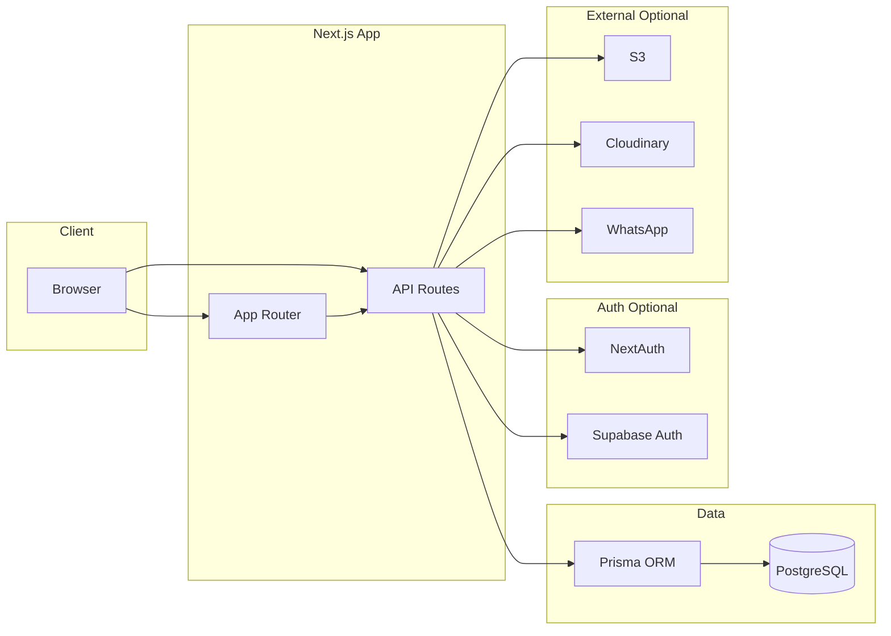
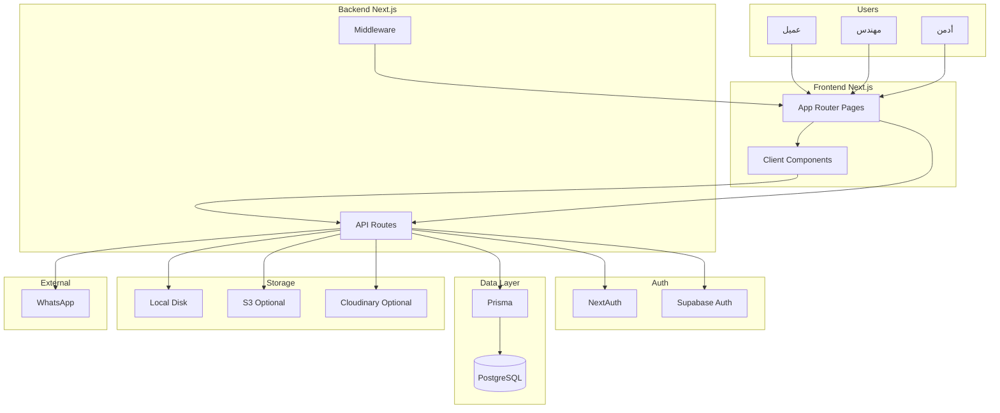

# تحليل النظام التقني الشامل (Technical Lead & System Architect)

تحليل معماري وتقني كامل للمنصة: التقنيات والمنصات، هيكل البيانات والعلاقات، الخوارزميات ومنطق العمل، الهيكل التنظيمي، مع مخرجات (مخطط ربط، أخطاء هيكلية، مقترحات أداء وتكلفة سحابية).

---

## 1. تحليل التقنيات والمنصات (Tech Stack & Platforms)

### 1.1 التقنيات المستخدمة ومدى توافقها مع أهداف المشروع

| التقنية | الاستخدام | التقييم |
|---------|-----------|---------|
| **Next.js 14** (App Router) | تقديم الصفحات، API Routes، Middleware | مناسب: دعم RTL، Server/Client، ونشر على Vercel. |
| **React 18** | واجهة المستخدم | معيار ويدعم التوسع. |
| **Prisma + PostgreSQL** | طبقة البيانات | اختيار سليم: علاقات واضحة، هجرات، وفك الارتباط عن منصة واحدة (قاعدة البيانات قابلة للنقل). |
| **NextAuth / Supabase Auth** | مصادقة (تبديل عبر env) | توافق مع أهداف المشروع؛ التنفيذ الحالي يسمح باختيار واحد فقط (لا دمج الاثنين). |
| **Tailwind CSS** | التنسيق | سريع التطوير ومتناسق مع Next. |
| **SWR** | جلب بيانات على العميل (مثلاً useMyOrders) | تخفيف الطلبات وتحديث تلقائي؛ مناسب لواجهات قائمة الطلبات. |
| **Zod** | التحقق من المدخلات في API | يقلل أخطاء البيانات ويوحّد الرسائل. |
| **Vercel (Speed Insights)** | استضافة ومراقبة | متوافق مع Next.js؛ التكلفة تعتمد على خطة الاستضافة. |

**ملاحظة:** لا يوجد Firebase في package.json؛ تمت إزالته. الإشارات المتبقية في lib/storage.ts (تعليق "Firebase Storage (Phase 4)") و scripts/clean-artifacts.js فقط — لا اعتماد فعلي.

### 1.2 الربط بين المنصات (Integrations) و Vendor Lock-in



- **قاعدة البيانات:** Prisma + PostgreSQL — لا lock-in؛ يمكن استبدال مضيف PostgreSQL (Supabase، Render، RDS، إلخ) مع الحفاظ على نفس المخطط.
- **المصادقة:** اختيار واحد (NextAuth أو Supabase حسب env). الاعتماد على Supabase يقتصر على Auth و/أو استضافة DB؛ يمكن العودة لـ NextAuth فقط بتغيير env وضبط الـ middleware.
- **التخزين:** lib/storage.ts يوفّر واجهة موحدة (uploadFile، deleteFileByUrl) مع تنفيذ محلي حالي؛ S3 و Cloudinary غير منفّذين. عند التنفيذ لاحقاً سيبقى التخزين مجرداً خلف واجهة واحدة.
- **Rate limiting:** lib/rateLimit.ts يستخدم مخزن في الذاكرة؛ في بيئة متعددة النسخ كل instance له عداد منفصل — لا توزيع حقيقي. الوثائق تذكر "consider Redis for production".
- **الخلاصة:** اعتمادية زائدة محدودة؛ أكبر ربط هو اختيار مصادقة واحد و (اختياري) Supabase كمنصة. التخزين والـ DB مصممان لتقليل الـ lock-in.

### 1.3 توزيع المهام بين العميل والخادم و SEO

- **الصفحة الرئيسية:** app/page.tsx مُعلّمة 'use client' وتجلب الباقات والمحتوى عبر lib/api.ts من المتصفح. المحتوى الديناميكي لا يُعرض في الـ HTML الأولي — محركات البحث قد لا ترى نفس المحتوى. app/layout.tsx يوفّر metadata ثابت (title, description) فقط.
- **API القراءة العامة:** app/api/packages/route.ts و app/api/content/homepage/route.ts يعملان على الخادم ويستخدمان unstable_cache مع Cache-Control — مناسب للأداء، لكن لا يُستغلان لـ SSR/RSC للصفحة الرئيسية.
- **توصية:** لتحسين SEO والسرعة: تقديم الصفحة الرئيسية (أو على الأقل قسم الباقات/المحتوى) كـ Server Component يجلب الباقات ومحتوى الصفحة من الخادم ويُضمّنها في الـ HTML الأولي، مع الإبقاء على التفاعل كـ Client Components حيث يلزم.

---

## 2. هيكل البيانات والعلاقات (Data Structures & Relations)

### 2.1 مخطط العلاقات (ER Logic)

```mermaid
erDiagram
  User ||--o{ Order : "clientOrders"
  User ||--o{ Order : "engineerOrders"
  User ||--o{ Message : "sender"
  User ||--o{ Notification : "userId"
  Package ||--o{ Order : "packageId"
  Order ||--o{ Message : "orderId"
  Order ||--o{ Plan : "orderId"
  Order ||--o{ Payment : "orderId"
  Order ||--o{ RevisionRequest : "orderId"
  Order ||--o{ PinPackPurchase : "orderId"
  Order ||--o{ OrderAuditLog : "orderId"
  User { string id PK string email string role }
  Order { string id PK string clientId FK string engineerId FK string status }
  Package { string id PK float price }
  Plan { string id PK string orderId FK string fileUrl }
  Message { string id PK string orderId FK string senderId FK }
  Payment { string id PK string orderId FK string status }
  RevisionRequest { string id PK string orderId FK }
  Notification { string id PK string userId FK }
  EngineerApplication { string id PK string token UNIQUE }
  PinPackConfig { string id PK }
  RevisionsPurchaseConfig { string id PK }
  HomepageContent { string id PK string content JSON }
```

- **علاقات أساسية:** User 1:N Order (كعميل وكمهندس)، Order N:1 Package، Order 1:N Message, Plan, Payment, RevisionRequest, PinPackPurchase, OrderAuditLog. User 1:N Notification. لا توجد علاقة Many-to-Many في المخطط الحالي — البنية بسيطة وواضحة.
- **جداول تكوين (شبه single-row):** PinPackConfig، RevisionsPurchaseConfig، HomepageContent — تخزين إعدادات أو محتوى في صف واحد.

### 2.2 أنواع البيانات والتوسع المستقبلي

- **المعرفات:** cuid() — مناسبة للتوزيع وتجنب التخمين. السلاسل النصية للأدوار والحالات (User.role, Order.status) تسمح بمرونة في القيم دون تغيير المخطط.
- **الحقول JSON:** formData (Order)، featuresJson (Package)، pins (RevisionRequest)، data (Notification)، content (HomepageContent) — مرنة للتوسع لكن بدون تحقق على مستوى DB؛ التحقق يتم في التطبيق (Zod).
- **الفهارس:** prisma/schema.prisma يحدد فهارس على المفاتيح الأجنبية وحقول التصفية الشائعة. مركّب @@index([status, createdAt]) على Order يدعم قوائم مرتبة — كفاية للتوسع المعتدل.

### 2.3 تعقيد جلب البيانات المرتبطة

- **قوائم الطلبات (Admin / Engineer):** findMany مع include (client، engineer، package) و select جزئي — استعلام واحد مع joins؛ لا N+1.
- **تفاصيل طلب واحد:** findUnique مع include — استعلام واحد.
- **تعقيد غير مبرر:** لا يظهر جلب متكرر لعلاقات في حلقة؛ البنية الحالية معقولة.

---

## 3. الخوارزميات ومنطق العمل (Algorithms & Business Logic)

### 3.1 الخوارزميات المستخدمة

- **حالة الطلب (Order Status):** lib/orderStateMachine.ts — جدول انتقالات ثابت ALLOWED_TRANSITIONS. التحقق عبر canTransition / validateTransition — O(1) بحث.
- **الفرز والتصفية:** داخل قاعدة البيانات عبر orderBy و where مع استخدام الفهارس — لا فرز في الذاكرة لصفوف كثيرة.
- **ترقيم الصفحات:** offset-based (skip/take + count) — مناسب لأحجام متوسطة.
- **المدفوعات:** app/api/payments/create/route.ts — idempotency عبر PaymentIdempotency، ثم prisma.$transaction لإنشاء/تحديث الدفع وتحديث حالة الطلب. التعقيد معقول.
- **ضغط الصور:** lib/imageCompression.ts يعمل في المتصفح؛ يتخطى الملفات الأصغر من 500KB. يقلل حجم الرفع ولا يستهلك موارد الخادم.

### 3.2 Bottlenecks وعمليات ثقيلة

- **Cron purge الأرشيف:** حلقة for لكل طلب مع transaction منفصل + إشعار منفصل — عدة round-trips إلى DB. مع مئات الطلبات قد يطول زمن التنفيذ. مقترح: تجميع تحديثات الـ plans في دفعات أو bulk update، وإرسال الإشعارات في دفعة إن أمكن.
- **Rate limiting في الذاكرة:** في بيئة serverless متعددة النسخ كل instance له عداد مستقل — التحديد الفعلي أضعف. لتحقيق حد موحد يُنصح بـ Redis (أو بديل موزع).
- **عدم حذف الملف الفعلي عند Purge:** الـ cron يحدّث Plan.purgedAt و fileUrl ولا يحذف الملف من القرص — استهلاك مساحة وملفات يتيمة.

### 3.3 تعقيد الدوال الحساسة

- **getApiAuth:** مع Supabase استعلامان محتملان (getUser ثم findUnique لـ User)؛ التعقيد ثابت.
- **قوائم الطلبات:** مع الفهارس الحالية استعلامات القائمة متوقعة أن تبقى ضمن نطاق O(log n) أو أفضل.

---

## 4. الهيكل التنظيمي للمشروع (Project Structure)

### 4.1 توافق مع Clean Architecture و Atomic Design

- **Clean Architecture:** المشروع لا يطبّق طبقات Domain / Application / Infrastructure بشكل صريح. منطق الأعمال داخل API Routes وملفات في lib. ARCHITECTURE.md يصف "Layered Architecture" كهدف توثيقي؛ التنفيذ الفعلي أقرب إلى feature-oriented مع lib مشتركة.
- **Atomic Design:** لا يوجد تنظيم atoms/molecules/organisms. components/ يحتوي على layout/, shared/, chat/, providers/, icons/. المكونات المشتركة في shared/ — درجة من إعادة الاستخدام دون تسمية Atomic صارمة.

### 4.2 إعادة الاستخدام وفصل المهام

- **إعادة الاستخدام:** مكونات components/shared/، hooks (useAuth، useApi، useMyOrders)، lib/requireAuth.ts — جيد.
- **فصل المهام:** مسارات الـ API تفصل بين التحقق والوصول للبيانات ومعالجة الأخطاء. كثير من الـ routes يدمج التحقق + استعلام + تحويل الاستجابة في ملف واحد — لا طبقة "Service" وسيطة. للمشروع الحالي مقبول؛ للتوسع يمكن استخراج خدمات (OrderService، PaymentService).

---

## 5. المخرجات المطلوبة

### 5.1 مخطط يربط المنصات بقواعد البيانات والواجهات



### 5.2 تقرير بالأخطاء الهيكلية (Architectural Flaws)

1. **الصفحة الرئيسية تعتمد على Client-side fetching للمحتوى الحيوي:** المحتوى والباقات لا يُضمّنان في الـ HTML الأولي — تأثير سلبي على SEO وسرعة الإدراك (LCP).
2. **عدم التحقق من الدور في Middleware عند Supabase:** مستخدم مسجّل بأي دور يمكنه فتح /admin/ و /engineer/ حتى ترجع الـ API 403 — تجربة مستخدم سيئة واحتمال كشف واجهات إدارية.
3. **Rate limiting غير موزع:** مخزن في الذاكرة؛ في بيئة متعددة النسخ لا يوجد حد موحد — ضعف في الحماية من الإساءة.
4. **Cron purge بعدد كبير من الـ round-trips:** حلقة مع transaction منفصل لكل طلب + إشعار منفصل — احتمال بطء واستهلاك اتصالات DB عند حجم كبير.
5. **تخزين الملفات: S3/Cloudinary غير منفّذين:** الإعداد الحالي يعتمد على التخزين المحلي فقط؛ على منصات مثل Vercel (read-only filesystem) الرفع سيفشل ما لم يُضاف تكامل سحابي فعلي.
6. **تعليق Firebase في storage.ts:** قد يسبب التباساً؛ يُفضّل إزالته أو توضيح أن الخيار المعتمد هو Local/S3/Cloudinary فقط.

### 5.3 مقترحات لتحسين الأداء وتقليل استهلاك الموارد السحابية

- **تحسين SEO والأداء الملموس:** جعل الصفحة الرئيسية (أو أقسامها الأساسية) تُقدّم من الخادم (RSC) مع جلب الباقات ومحتوى الصفحة من الـ cache/DB وإدراجها في الـ HTML. تقليل الاعتماد على جلب كامل المحتوى من العميل بعد التحميل.
- **تقليل استهلاك DB في Cron:** تجميع تحديثات الـ plans (bulk update أو batch) بدلاً من transaction منفصل لكل طلب؛ تخفيض عدد الـ round-trips ووقت تنفيذ الـ cron.
- **حذف الملفات الفعلية عند Purge:** في مسار الـ cron (أو مهمة منفصلة) استدعاء حذف الملف من التخزين (محلي أو سحابي) عند تحديث fileUrl/purgedAt لتجنب استهلاك مساحة وملفات يتيمة.
- **توحيد Rate limiting في الإنتاج:** استخدام Redis (أو بديل) لمخزن موزع عند تشغيل أكثر من instance لضمان حد طلبات موحد وتقليل احتمال استنزاف الموارد.
- **التخزين المؤقت للقراءة:** الاستمرار في استخدام unstable_cache و Cache-Control للـ endpoints العامة؛ مراجعة أوقات revalidate حسب معدل التحديث.
- **تقليل حجم الاستجابات:** تجنب إرجاع حقول غير ضرورية في قوائم الطلبات لتقليل استهلاك النطاق ووقت الاستجابة.
- **مراقبة التكلفة السحابية:** مراجعة استدعاءات الـ API ووقت تنفيذ الـ serverless، وضبط المهلات وإكمال الـ cron في وقت معقول؛ إن تجاوز الـ cron حد وقت التنفيذ، تقسيم العمل إلى دفعات أو جدولة متعددة.

---

## 6. ملخص الملفات المرجعية

| الغرض | الملف |
|--------|--------|
| تعريف المخطط والعلاقات | prisma/schema.prisma |
| منطق حالة الطلب | lib/orderStateMachine.ts |
| التخزين (محلي / S3 / Cloudinary) | lib/storage.ts |
| ضغط الصور (عميل) | lib/imageCompression.ts |
| معالجة المدفوعات + Idempotency | app/api/payments/create/route.ts |
| Cron purge الأرشيف | app/api/cron/purge-archived-plans/route.ts |
| Rate limiting | lib/rateLimit.ts |
| كاش الباقات ومحتوى الصفحة | app/api/packages/route.ts، app/api/content/homepage/route.ts |
| وصف المعمارية | ARCHITECTURE.md |
