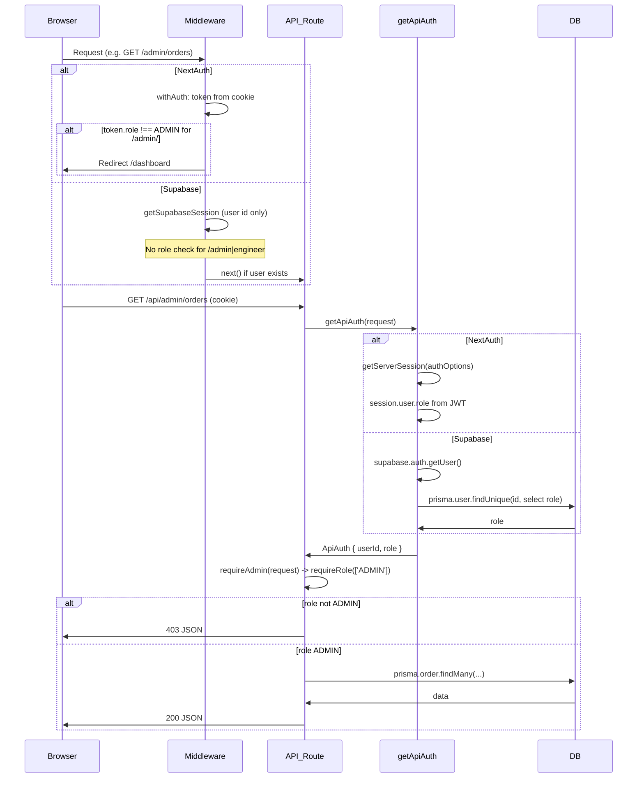

# مراجعة هيكلية المستخدمين والصلاحيات والربط (User Roles & API Integration)

مراجعة معمارية شاملة لنظام الأدوار والصلاحيات، العقد بين الواجهة والباك-أند، وأمن الربط مع مخرجات: خريطة تدفق الطلب، ثغرات منطق الصلاحيات، ومقترحات تحسين استجابة الـ API.

---

## 1. نظام المستخدمين والأدوار (User Roles & ACL)

### 1.1 أنواع المستخدمين المحددة

- **ADMIN:** صلاحيات كاملة (إحصائيات، مستخدمين، طلبات، مهندسين، إعدادات، محتوى).
- **ENGINEER:** طلبات معينة له فقط، رفع مخططات، رسائل، تعديل حالة الطلب، تمديد، بدء عمل.
- **CLIENT:** طلباته فقط، إنشاء طلب، طلبات تعديل، شراء تمديد/دبابيس/تعديلات، رسائل، تحميل مخططات.

**ملاحظة:** لا يوجد دور "Guest" في المخطط؛ الزائر غير المسجل يعامل كـ unauthenticated (إعادة توجيه لصفحة تسجيل الدخول أو 401 من الـ API). المسارات العامة محددة في lib/routes.ts (الصفحة الرئيسية، تسجيل الدخول، التسجيل، نسيت كلمة المرور، تقديم مهندس).

### 1.2 مصفوفة الصلاحيات (Permissions Matrix)

| المورد / الإجراء                      | ADMIN            | ENGINEER                 | CLIENT                  |
| ------------------------------------- | ---------------- | ------------------------ | ----------------------- |
| لوحة الإدارة /admin/*                 | نعم              | لا                       | لا                      |
| لوحة المهندس /engineer/*              | نعم              | نعم (معيّن)              | لا                      |
| طلبات العميل /orders/*                | نعم (كل الطلبات) | لا (يُوجّه لـ /engineer) | طلباته فقط              |
| GET /api/orders/[id]                  | أي طلب           | الطلب المعيّن له         | طلبه فقط                |
| GET /api/orders/my-orders             | —                | —                        | نعم (مرشّح بـ clientId) |
| GET /api/engineer/orders              | نعم              | نعم (طلباته)             | لا                      |
| رفع مخطط /api/plans/upload            | نعم              | نعم (للطلب المعيّن له)   | لا                      |
| تحميل مخطط                            | نعم              | نعم (طلب معيّن)          | طلبه فقط                |
| رسائل الطلب                           | نعم              | طلب معيّن                | طلبه فقط                |
| إنشاء طلب / شراء تمديد/دبابيس/تعديلات | —                | —                        | نعم (requireClient)     |
| إحصائيات ومستخدمين وإعدادات           | نعم فقط          | لا                       | لا                      |

الفصل بين ما يراه المسؤول وما يراه المستخدم العادي واضح على مستوى الـ API عبر requireAdmin و requireEngineerOrAdmin و requireClient وفحص الموارد (مثل order.clientId / order.engineerId).

### 1.3 تخزين دور المستخدم وإمكانية التلاعب من العميل

- **التخزين:**
  - **قاعدة البيانات:** prisma/schema.prisma — User.role (نوع String، افتراضي "CLIENT").
  - **NextAuth:** الدور يُنسخ إلى JWT عند تسجيل الدخول من lib/auth.ts (authorize يرجع user.role من DB، ثم jwt/session callbacks يضعان token.role و session.user.role). الجلسة موقّعة بـ NEXTAUTH_SECRET — العميل لا يستطيع تعديل الدور دون كسر التوقيع.
  - **Supabase:** الجلسة من Supabase (auth.users)؛ الدور لا يُخزّن في الـ JWT من Supabase بل يُقرأ من قاعدة البيانات في كل طلب API عبر lib/getApiAuth.ts (استعلام prisma.user.findUnique لـ role). أي تغيير للدور في DB ينعكس فوراً على الصلاحيات.
- **الخلاصة:** التلاعب بالدور من جهة العميل غير فعّال لأن:
  - NextAuth: JWT موقع؛ التعديل يفسد التوقيع.
  - Supabase: الدور يُحدد من السيرفر (DB) في كل استدعاء لـ getApiAuth، وليس من بيانات العميل.

---

## 2. العلاقة بين الواجهة والباك-أند (Frontend–Backend Contract)

### 2.1 طريقة طلب البيانات (Data Fetching)

- **REST API فقط:** لا يوجد GraphQL ولا Server Actions مستخدمة لجدولة البيانات المحمية. الواجهة تستدعي lib/api.ts (و apiPostFormData للرفع) عبر fetch إلى /api/... مع credentials: 'include'.
- **المصادقة:** عبر كوكي الجلسة (NextAuth أو Supabase)؛ لا يُستخدم Authorization: Bearer (lib/apiTokenGetter.ts يُرجع null وغير مستخدم).

### 2.2 حماية المسارات (Route Guarding): واجهة مقابل باك-أند

- **الواجهة (Middleware):**
  - **NextAuth:** middleware.ts — withAuth يتحقق من وجود token؛ إن وُجد يتحقق من المسار:
    - /admin/* → إن token.role !== 'ADMIN' يُوجّه إلى /dashboard.
    - /engineer/* (ما عدا engineer/apply/) → إن لم يكن ENGINEER أو ADMIN يُوجّه إلى /dashboard.
    - /orders/* → إن كان ENGINEER يُوجّه إلى /engineer/dashboard.
  - **Supabase:** نفس الملف — الدالة supabaseMiddleware تتحقق فقط من وجود مستخدم (user من getSupabaseSession). لا يوجد تحقق من الدور لـ /admin/ أو /engineer/؛ أي مستخدم مسجّل يمكنه فتح هذه المسارات حتى تفشل استدعاءات الـ API لاحقاً (ثغرة منطقية — انظر القسم 4).
- **الباك-أند:** كل مسار API محمي يستخدم lib/requireAuth.ts: requireAuth، requireRole، requireAdmin، requireEngineerOrAdmin، requireClient. بالإضافة إلى فحص الموارد في مسارات مثل app/api/orders/[id]/route.ts، app/api/messages/[orderId]/route.ts، app/api/orders/[id]/plans/[planId]/download/route.ts. التحقق في الباك-أند هو مصدر الحقيقة؛ حماية الواجهة للراحة وليس للأمان.

### 2.3 تمرير بيانات حساسة في استجابة الـ API

- **GET /api/auth/me:** يُرجع id, name, email, role فقط — لا كلمة مرور.
- **GET /api/admin/users:** لا يُضمّن password (استخدام select بدون password) — جيد.
- **GET /api/orders/[id]:** يُرجع الطلب مع client: { id, name, email, phone } و engineer: { id, name, email }. رقم الجوال يصل للمهندس والأدمن؛ إن كان ذلك مقصوداً للتواصل فهو مقبول، لكنه PII ويُفضّل توثيقه وربما تقييده حسب السياسة.
- **باقي المسارات:** لا يظهر تمرير كلمات مرور أو مفاتيح داخلية في الاستجابات المفحوصة.

---

## 3. أمن الربط (Integration Security)

### 3.1 CORS والنطاقات المسموح لها

- **لا يوجد تكوين CORS صريح** في next.config.js. التطبيق يعمل بنمط نفس المصدر (same-origin)؛ الـ frontend يطلب /api من نفس الـ origin، لذا لا حاجة لـ CORS للاستخدام الحالي.
- **CSP في next.config.js:** connect-src 'self' https://*.supabase.co wss://*.supabase.co (+ localhost في التطوير). أي طلب API من نطاق آخر سيواجه قيود المتصفح وربما يحتاج لاحقاً إلى CORS صريح — حالياً غير مطلوب.

### 3.2 إرسال الـ Tokens في الـ Headers

- **لا Bearer token:** الاعتماد على كوكي الجلسة (NextAuth أو Supabase) مع credentials: 'include' في lib/api.ts. الـ session تُقرأ من الكوكي في السيرفر. آمن لنفس المصدر؛ لو تم دعم عميل من نطاق آخر لاحقاً قد يُنظر في استخدام Bearer (مثلاً من تطبيق موبايل).

### 3.3 معالجة الأخطاء الموحدة (Global Error Handling)

- **في مسارات الـ API:** lib/errors.ts — handleApiError يعالج Zod و Prisma و AppError. في الإنتاج يُرجع رسائل عامة ولا يكشف تفاصيل تقنية. في التطوير يُضاف errorId وأحياناً code.
- **مسارات تعيد 401/403 مباشرة:** requireAuth و requireRole تُرجع NextResponse.json دون المرور بـ handleApiError — مقصود ومراقب.
- **توصية:** التأكد من أن كل مسار API محمي يلفّ المنطق في try/catch ويستدعي handleApiError للاستثناءات غير المتوقعة.

---

## 4. المخرجات المطلوبة

### 4.1 مخطط تدفق الطلب من الواجهة حتى التحقق من الصلاحية

### 4.2 ثغرات محتملة في منطق الصلاحيات (Logic Flaws)

1. **عدم التحقق من الدور في Middleware عند استخدام Supabase:** عند NEXT_PUBLIC_USE_SUPABASE_AUTH=true، المستخدم المسجّل (أي دور) يمكنه دخول /admin/ و /engineer/ حتى تحمي الـ API الطلبات وتُرجع 403. المقترح: جلب الدور في الـ middleware عند Supabase (مثلاً من DB أو من endpoint داخلي) وتطبيق نفس قواعد إعادة التوجيه حسب المسار والدور كما في NextAuth.
2. **GET /api/orders/my-orders لا يقيّد بالدور:** المسار يستخدم requireAuth فقط ويصفّي بـ clientId: auth.userId. مهندس أو أدمن يستطيع استدعاءه ويحصل على قائمة الطلبات التي يكون فيها هو العميل فقط. السلوك صحيح لـ "طلباتي كعميل"، لكن التسمية قد توحي بغير ذلك. يمكن توضيح السلوك في الوثائق أو تقييد المسار بـ CLIENT فقط إذا كان المقصود حصراً واجهة العميل.
3. **تسريب رقم الجوال (PII) في GET /api/orders/[id]:** العميل والمهندس والأدمن يحصلون على client.phone. إن كانت السياسة تمنع إظهار الرقم الكامل للمهندس فيمكن تقليمه في الاستجابة أو إرجاعه فقط للأدمن.
4. **اعتماد واجهة المستخدم على دور من الجلسة/API:** مع NextAuth الدور في الـ JWT قد يكون قديماً إذا تم تغيير الدور من قبل أدمن دون إعادة تسجيل دخول. مع Supabase الدور يُحدّث في كل طلب. لتحسين الاتساق يمكن إما تقصير عمر الجلسة أو إعادة جلب الدور من /api/auth/me دورياً في الواجهة عند NextAuth أيضاً.

### 4.3 مقترح تحسين استجابة الـ API (كفاءة وأماناً)

- **توحيد شكل الاستجابة:**
  - نجاح: `{ success: true, data?: T, ... }` للبيانات، وعدم إرجاع حقول إضافية غير ضرورية.
  - خطأ: `{ success: false, error: string, code?: string }` مع عدم إرجاع errorId أو تفاصيل تقنية في الإنتاج.
- **تقليل الحقول الحساسة حسب الدور:** في GET /api/orders/[id] يمكن إرجاع client.phone فقط لـ ADMIN، وللعميل/المهندس إرجاع نسخة مقنّعة أو عدم إرجاعها حسب السياسة.
- **عدم إرجاع الدور في كل استجابة:** الدور مطلوب للواجهة في /api/auth/me؛ تجنب تكراره في استجابات أخرى لا تحتاجه.
- **استخدام handleApiError في جميع المسارات:** التأكد من أن كل route handler محمي داخل try/catch ويستدعي handleApiError(error) في الـ catch.
- **توثيق العقد (API contract):** وثيقة أو تعليقات توضّح أي حقول تُرجع لأي دور لتسهيل المراجعات المستقبلية ومنع تسرب بيانات بالخطأ.

---

## 5. ملخص الملفات الأساسية

| الغرض                           | الملف |
| ------------------------------- | ----- |
| تعريف الأدوار في DB             | prisma/schema.prisma (User.role) |
| استخراج المستخدم والدور في API  | lib/getApiAuth.ts |
| التحقق من الصلاحية في API       | lib/requireAuth.ts |
| حماية المسارات (صفحات)          | middleware.ts |
| جلسة Supabase في الـ Edge       | lib/supabase/middleware.ts |
| مسارات عامة                     | lib/routes.ts |
| استدعاء API من الواجهة          | lib/api.ts |
| معالجة الأخطاء في API           | lib/errors.ts |
| تكوين الجلسة والمصادقة NextAuth | lib/auth.ts |
